# 📺 YouTube Data Engineering Pipeline: Complete Project Documentation

This document provides a comprehensive technical overview of the YouTube Data Engineering project, explaining its architecture, automated flows, and infrastructure-as-code (Terraform) design.

---

## 🏗️ 1. High-Level Architecture
The project follows a modern **Cloud-Native Data Lakehouse** architecture, leveraging AWS serverless services for cost-efficiency and scalability.

```mermaid
graph LR
    Local["💻 Local Data / GitHub"] -->|Auto-Ingest| S3_Raw["🪣 S3 Raw Bucket"]
    S3_Raw -->|Trigger| Lambda["λ Lambda (JSON to Parquet)"]
    Lambda -->|Store| S3_Clean["🪣 S3 Cleansed Bucket"]
    S3_Clean -->|Catalog| Glue_Catalog["📚 Glue Data Catalog"]
    Glue_Catalog -->|ETL Job| Glue_Spark["⚡ Glue Spark ETL (Join/Transform)"]
    Glue_Spark -->|Sink| S3_Analytics["🪣 S3 Analytics Bucket"]
    S3_Analytics -->|Visualize| EC2_Dashboard["📊 EC2 Streamlit Dashboard"]
    S3_Analytics -->|Query| Athena["🔍 AWS Athena"]
```

---

## 🛠️ 2. Core Components

### 🪣 A. S3 Data Lake (3-Tier)
1.  **Raw Bucket**: Stores landing data in original formats (.json and .csv). Organized by partition (e.g., `region=us/`).
2.  **Cleansed Bucket**: Stores cleaned reference data in **Apache Parquet** format for high-performance querying.
3.  **Analytics Bucket**: Stores the final, joined dataset where statistics and categories are merged.

### λ B. Serverless Processing (Lambda)
*   **Purpose**: Automatically converts raw JSON category files into Parquet whenever a new file lands in the Raw bucket.
*   **Runtime**: Python 3.12 (x86_64).
*   **Layers**: Uses `AWSSDKPandas` (Wrangler) for direct S3-to-Pandas-to-Parquet conversion.

### ⚡ C. Big Data ETL (AWS Glue)
*   **Glue Catalog**: Automatically creates and updates tables for Athena querying.
*   **Glue ETL Job**: A PySpark script that joins the cleaned JSON reference data with CSV statistics. 
*   **Cost Strategy**: Uses `FLEX` execution class and `G.1X` workers to reduce costs by ~35%.

### 📊 D. Visualization (EC2 & Streamlit)
*   **Hosting**: t3.micro EC2 instance.
*   **Automation**: Uses a `user_data` script that:
    1.  Sets up a Python Virtual Environment.
    2.  Installs Streamlit, Pandas, Plotly, and Boto3.
    3.  Downloads the latest `dashboard.py` and data from S3.
    4.  Exposes the dashboard on port `8501`.

---

## 🤖 3. Automation Workflows

### 💻 Local-to-AWS Sync (`auto_ingest.py`)
A Python script using the `watchdog` library that monitors your local `data/` folder.
*   **Mechanism**: If you drop an `.xlsx`, `.csv`, or `.json` file into the folder, it is instantly uploaded to the correct AWS S3 partition.
*   **Usage**: `python auto_ingest.py`

### 🐙 GitHub-to-AWS Sync (GitHub Actions)
A CI/CD pipeline defined in `.github/workflows/data_sync.yml`.
*   **Mechanism**: When you `git push` new data to the GitHub repository, a GitHub Runner uses the provided IAM credentials to sync the files to your S3 Raw bucket.
*   **Security**: Uses limited-scope IAM credentials (Push-only).

---

## 🚀 4. Re-Deployment Guide

If you want to redeploy this project from scratch with **zero errors**:

1.  **Configuration**: Open `terraform_new/main.tf` and check the region/project naming.
2.  **Initialize**: Run `terraform init`.
3.  **Apply**: Run `terraform apply -auto-approve`.
4.  **Populate**: Drop your data into the `data/` folder and run `python auto_ingest.py`.

### 🗝️ Sensitive Files (Kept Local)
*   `terraform_new/terraform.tfstate`: Essential for Terraform to manage your resources. **Do not delete if you want to modify existing infrastructure.**
*   `auto_ingest.py`: Your local gateway to the cloud.

---

## 🛠️ Troubleshooting
*   **Dashboard Not Loading?** Wait ~3-5 mins after deployment for the EC2 setup script to finish.
*   **Data Not Showing?** Check the Glue Job console to ensure the ETL script has finished processing the raw data.

